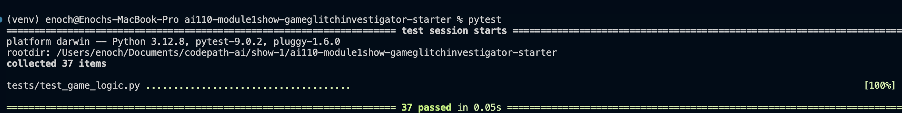
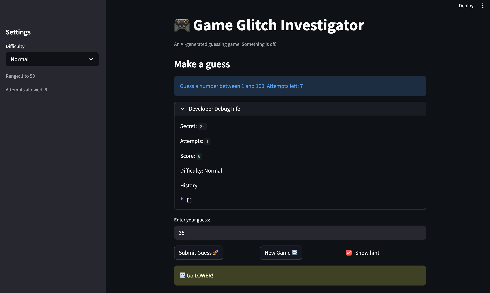

# 🎮 Game Glitch Investigator: The Impossible Guesser

## 🚨 The Situation

You asked an AI to build a simple "Number Guessing Game" using Streamlit.
It wrote the code, ran away, and now the game is unplayable.

- You can't win.
- The hints lie to you.
- The secret number seems to have commitment issues.

## 🛠️ Setup

1. Install dependencies: `pip install -r requirements.txt`
2. Run the broken app: `python -m streamlit run app.py`

## 🕵️‍♂️ Your Mission

1. **Play the game.** Open the "Developer Debug Info" tab in the app to see the secret number. Try to win.
2. **Find the State Bug.** Why does the secret number change every time you click "Submit"? Ask ChatGPT: _"How do I keep a variable from resetting in Streamlit when I click a button?"_
3. **Fix the Logic.** The hints ("Higher/Lower") are wrong. Fix them.
4. **Refactor & Test.** - Move the logic into `logic_utils.py`.
   - Run `pytest` in your terminal.
   - Keep fixing until all tests pass!

## 📝 Document Your Experience

- [x] Describe the game's purpose.
      The game is a guessing-type where a player is prompted to guess a secret number using a pre-defined number of attempts. The player is hinted after each guess prompting them to either go lower or go higher with their guesses depending on whether the guess is greater or lesser than the secret number.

- [x] Detail which bugs you found.

* The hints were backwards and not helpful most times in getting the secret number. For example when the secret number is greater than what was guessed, the hints could say go lower and vice versa which is misleading.
* The new game was not resetting the history and did not allow for new hunts or new submissions.
* The range for the medium difficulty was larger than that of the hard difficulty which most likely should not be.

- [x] Explain what fixes you applied.

* `check_guess()`: Returned appropraiate hints for each case of the guess being greter or lesser than the secret number, also properly checked and covered for different input value data types
* `update_score()`: Removed the even attempt bonus for "Too High" guesses. Both incorrect guesses (Too High and Too Low) should be penalized equally. The previous logic incorrectly rewarded guesses on even attempts regardless of correctness.
* `parse_guess()`: FIX: Parse only trimmed whole-number input; removed float-to-int truncation (e.g., "12.9" -> 12) and narrowed exception handling to ValueError return True, value, None

## 📸 Demo

- [ ] []
- []

## 🚀 Stretch Features

- [ ] [If you choose to complete Challenge 4, insert a screenshot of your Enhanced Game UI here]
